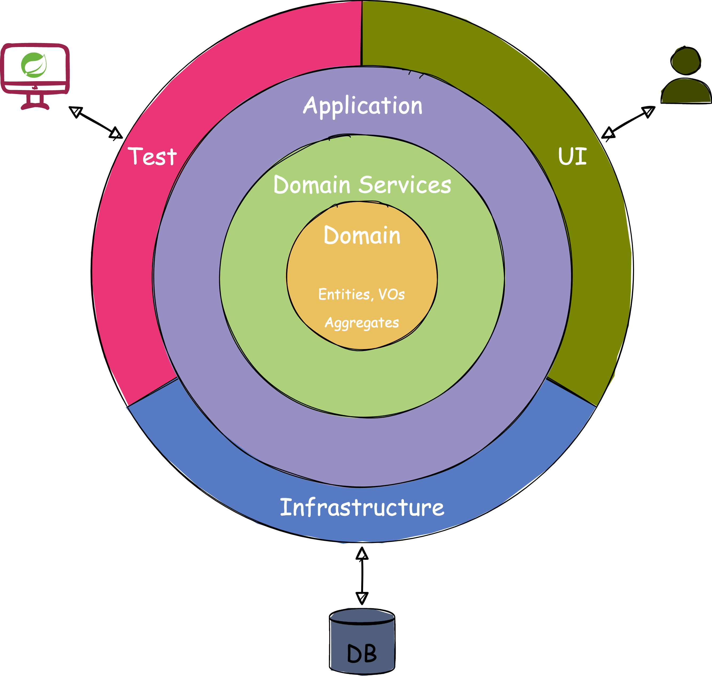

## 1. Architecture

| Layer          | -           | -                                                       | Description |
|----------------|-------------|---------------------------------------------------------|-------------|
| presentation   | controller  | dto ( in - request, out - response )  ...Controller |             |
| application    | facade      | dto ( in - ...FacadeDto, out - ...Info )  ...Facade |             |
| domain         | interfaces  | ...Repository                                           |             |
|                | model       | 모델 이름(Member 등)                                         |             |
|                | service     | dto ( in - ...ServiceDto, out - model )  ...Service |             |
| infrastructure | entity      | ...Entity                                               |             |
|                | mapper      | ...Mapper                                               |             |
|                | persistence | ...JpaRepository                                        |             |
|                | repository  | ...RepositoryImpl                                       |             |

 

## 2. Commit Message

**EX)**  
feat: 유저 조회 API 구현   
마이페이지 유저 정보조회를 위한 API를 구현했습니다.

| 타입       | 설명                                          |
|----------|---------------------------------------------|
| feat     | 새로운 기능 추가                                   | 
| fix      | 버그 수정                                       |
| docs     | 문서 수정                                       |
| style    | 코드 스타일 변경 (코드 포맷팅, 세미콜론 누락 등, 기능 변경이 없는 경우) |
| refactor | 코드 리팩토링                                     |
| perf     | 성능 개선                                       |
| test     | 테스트 코드                                      |
| chore    | 빌드 업무 수정, 패키지 매니저 수정                        |
| rename   | 파일 혹은 폴더명을 수정만 한 경우                         |
| remove   | 파일을 삭제한 경우                                  |

